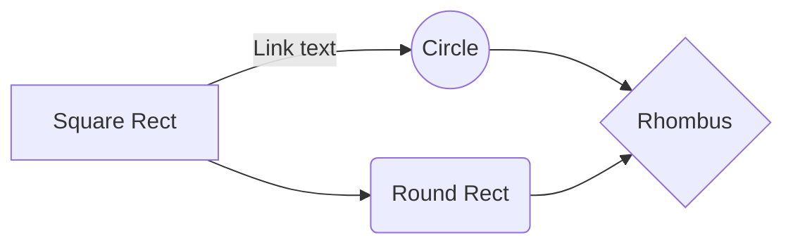

# bravebits Code Train

FREE & OPEN SOURCE SOFTWARE

FOR QUICKLY STARTING TO CODE

✯✯✯✯✯✯✯✯✯✯✯✯✯✯✯✯✯✯✯✯

QUICK STARTS

(marked with stars)

fork your own branch

and start tinkering 

in the browser

in seconds for free

✯✯✯✯✯✯✯✯✯✯✯✯✯✯✯✯✯✯✯✯

################################################################

Javascript, HTML5, CSS, & Digital Art 

via 

Phaser 3 - Desktop and Mobile HTML5 game framework:

https://phaser.io/

https://github.com/photonstorm/phaser

3 Examples of Pro Games:

https://www.cartoonnetwork.co.uk/games/unikitty-save-the-kingdom

https://robowhale.com/html5/mr-driller/

https://games.gamecommerce.com/incredibles2/index.html

many more:

https://phaser.io/games

LEARN:

https://phaser.io/learn

EXAMPLES:

http://labs.phaser.io/view.html?src=src/games/firstgame/part10.js

http://labs.phaser.io/view.html?src=src/games/flood/flood-fill.js

http://labs.phaser.io/view.html?src=src/games/breakout/breakout.js

more (none are as good as above 3):

http://labs.phaser.io/index.html?dir=games/&q=

✯✯✯✯✯✯✯✯✯✯✯✯✯✯✯✯✯✯✯✯✯✯✯✯✯✯✯✯✯✯✯✯✯✯✯✯✯✯✯✯✯✯✯✯✯✯

✯✯✯✯ bravebits fork of firstgame example: ✯✯✯✯

https://sunrise-gosling.glitch.me

https://glitch.com/edit/#!/sunrise-gosling

(in the browser - no installation necessary)

✯✯✯✯✯✯✯✯✯✯✯✯✯✯✯✯✯✯✯✯✯✯✯✯✯✯✯✯✯✯✯✯✯✯✯✯✯✯✯✯✯✯✯✯✯✯

free online image editor:

https://www.photopea.com/

Javascript, HTML, CSS:

https://developer.mozilla.org/

################################################################

Angular HTML

via

CYO - Choose Your Own Adventure Framework:

http://danielstern.github.io/cyo/

https://github.com/danielstern/cyo

✯✯✯✯✯✯✯✯✯✯✯✯✯✯✯✯✯✯✯✯✯✯✯✯✯✯✯✯✯✯✯✯✯✯✯✯✯✯✯✯✯✯✯✯

bravebits fork of CYO example:

https://messy-cyclone.glitch.me

https://glitch.com/edit/#!/messy-cyclone

(in the browser - no installation necessary)

✯✯✯✯✯✯✯✯✯✯✯✯✯✯✯✯✯✯✯✯✯✯✯✯✯✯✯✯✯✯✯✯✯✯✯✯✯✯✯✯✯✯✯✯

bravebits fork of CYO in Github:

https://github.com/oxbits/cyo

https://oxbits.github.io/cyo/skool.html

Angular:

https://angular.io/

Bootstrap:

https://getbootstrap.com/

################################################################

Python3 - Jupyter Notebooks (iPython)

Google Colaboratory:

https://colab.research.google.com/notebooks/welcome.ipynb

(in the browser - no installation necessary)

✯✯✯✯✯✯✯✯✯✯✯✯✯✯✯✯✯✯✯✯✯✯✯✯✯✯✯✯✯✯✯✯✯✯✯✯✯✯✯✯✯✯✯✯✯✯✯✯✯✯✯✯✯✯✯✯✯✯✯✯✯✯✯✯✯✯✯✯✯✯✯✯✯

bravebits example notebook:

https://colab.research.google.com/drive/1hLYN9kHEajeFcUaTPnpJBdKGtPOy22Qp

(in the browser - no installation necessary)

click "open in playground"

you will need a google account

it will ask if you want to run the code, 

whether you restart the code or not,

as always: if you trust the source, run it, otherwise do not

✯✯✯✯✯✯✯✯✯✯✯✯✯✯✯✯✯✯✯✯✯✯✯✯✯✯✯✯✯✯✯✯✯✯✯✯✯✯✯✯✯✯✯✯✯✯✯✯✯✯✯✯✯✯✯✯✯✯✯✯✯✯✯✯✯✯✯✯✯✯✯✯✯

Python:

https://www.python.org/

Docs:

https://docs.python.org/3/

Learn:

https://www.python.org/about/gettingstarted/

Pandas - Python Data Analysis Library:

https://pandas.pydata.org/

Python Pillow: (PIL python image library)

https://pillow.readthedocs.io/en/stable/

matplotlib

https://matplotlib.org/

https://matplotlib.org/gallery/lines_bars_and_markers/simple_plot.html

Word Cloud:

https://github.com/amueller/word_cloud

https://github.com/amueller/word_cloud/blob/master/examples/simple.py

scikit-learn - (machine learning):

https://scikit-learn.org/stable/

https://scikit-learn.org/stable/auto_examples/datasets/plot_iris_dataset.html

Jupyter Notebooks:

https://jupyter.org/

iPython:

https://ipython.org/

The Hitchhiker's Guide to Python:

https://docs.python-guide.org/

(very helpful for installing on your computer)

################################################################

Git repos:

https://github.com/

https://gitlab.com/

################################################################

SEARCH FOR IT!:

https://duckduckgo.com/

################################################################

And this will produce a flow chart:

